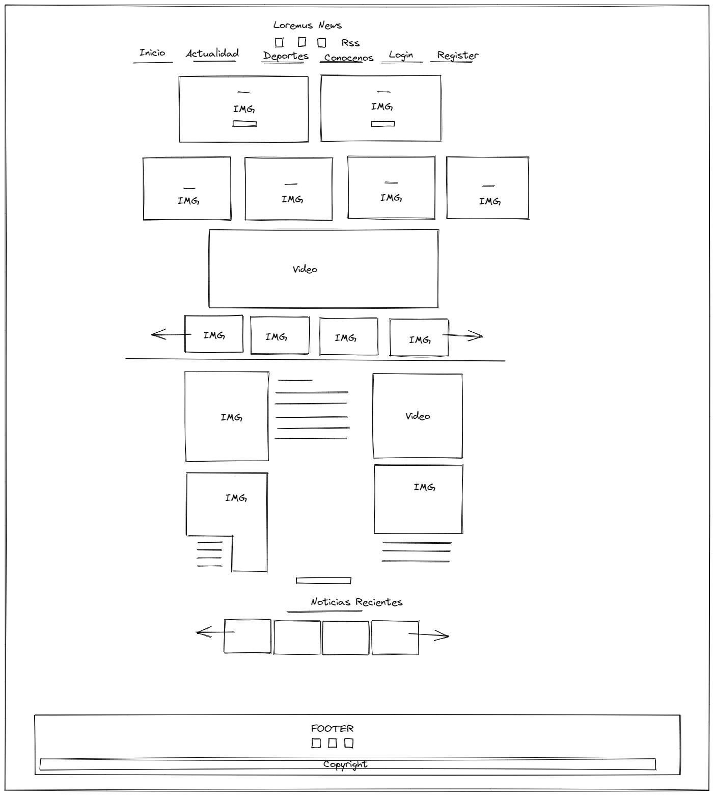
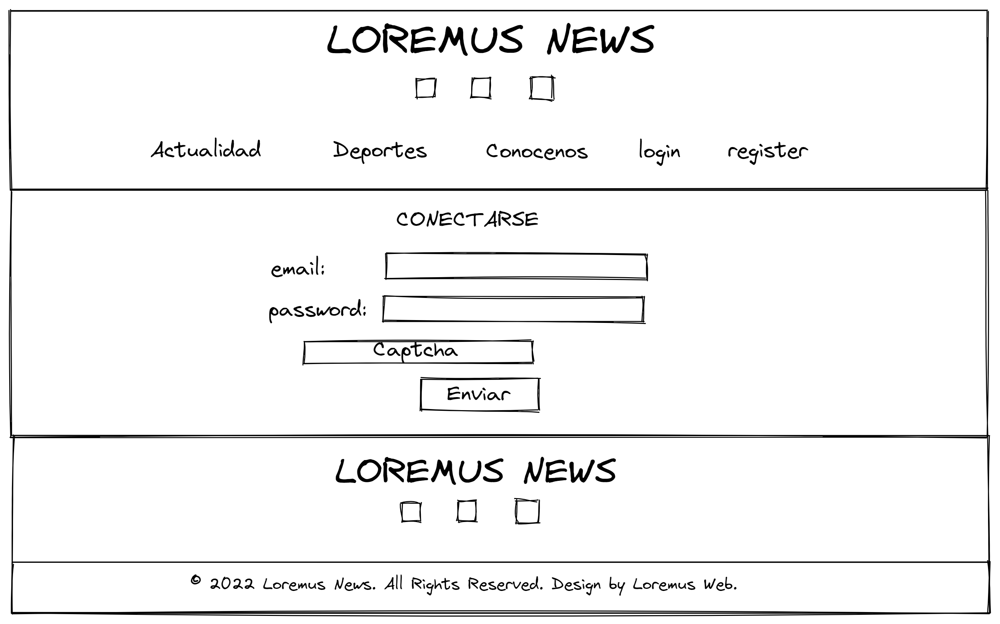
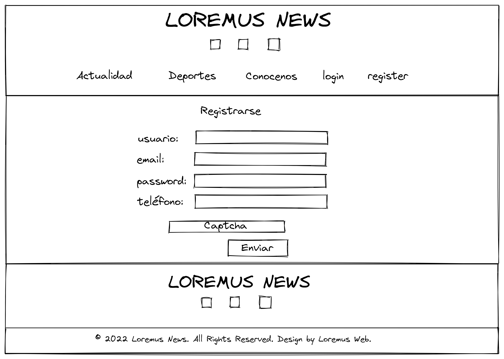
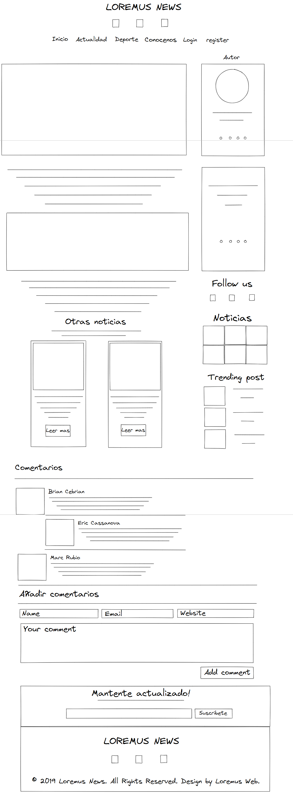
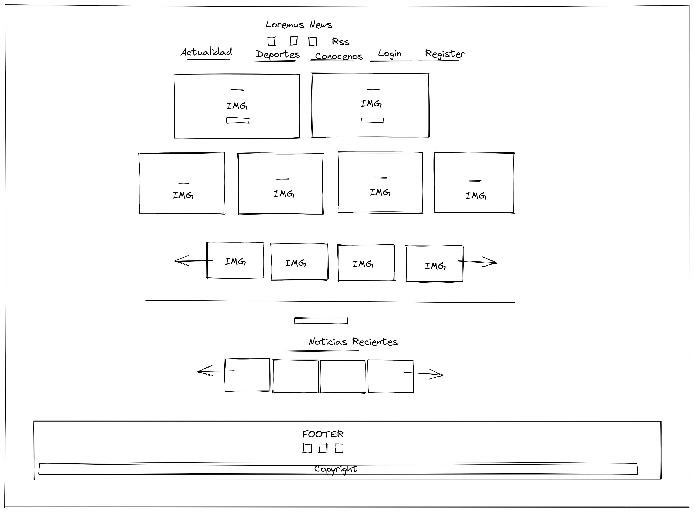
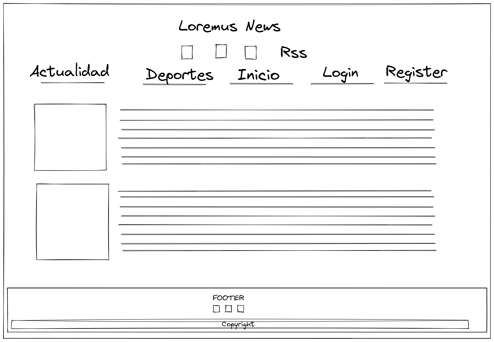
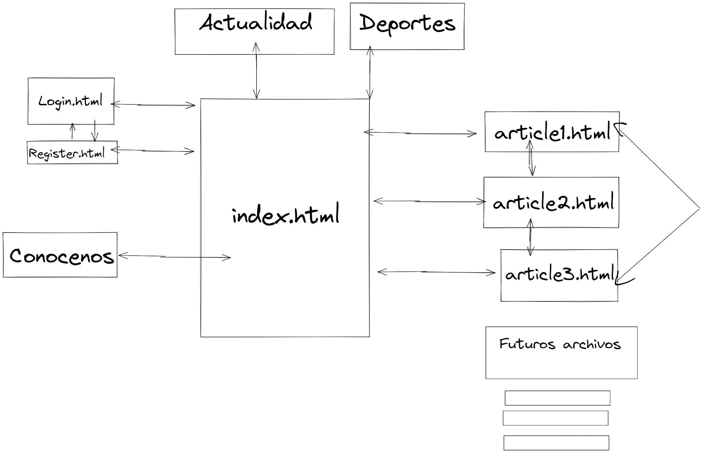

# Proyecto

Queremos crear una web en la que usaremos HTML, JS, CSS y un poco de PHP, la idea es conseguir poder hacer registro, login en la web y navegar por toda la web.

## Ideas

- **1 Portal Noticias**
- 2 Tienda segunda mano
- 3 Peliculas descargas
- 4 Red social
- 5 Mailing
- 6 Red social de citas
- 7 Compartir archivos online
- 8 Foro
- 9 Tienda Online
- 10 Videos Online

---

#### 1 Portal de Noticias

Hemos escogido esta idea porque es la que mas se adapta a lo que queremos hacer y parece divertida y mas sencilla y productiva que otras.
Se basa en una web con un apartado de Registro, Login,Pagina principal y dos subapartados.
En la pagina principal veremos noticias varias y en los subapartados tendremos uno dedicado al deporte y otro a noticias de la actualidad.

#### 2 ~~Tienda segunda mano~~

Esta idea era hacer un portal donde los usuarios pudieran subir sus articulos de segunda mano para vender.

#### 3 ~~Peliculas descagas~~

Esta idea era hacer un portal donde poder descargar peliculas online directamente sin el uso de programas a traves de descarga directa.

#### 4 ~~Red Social~~

Esta idea era hacer una red social en la cual puedas ver archivos multimedias de el resto de personas y tambien poder hablar atraves de un chat directo con la persona que quieras.

#### 5 ~~Mailing~~

Esta idea era un simple portal de enviar y recibir correos electronicos.

#### 6 ~~Red social de citas~~

Esta idea era parecida a la idea 4 pero con la diferencia que en esta para poder chatear con alguien debes haber tenido previamente un match muteuo con la persona.

#### 7 ~~Compartir archivos online~~

Esta idea se basa en una pagina donde poder compartir archivos online, donde el usuario subira un archivo de cualquier tipo y se le generaria un link para compartir la descarga con quien quisiera.

#### 8 ~~Foro~~

Esta idea nos parecio tambien muy buena para hacer que era basicamente un foro donde podias preguntar o compartir opiniones y los usuarios podian contestar estos post.

#### 9 ~~Tienda Online~~

Esta idea se basa en una pagina de venta de productos online donde las empresas pueden poner sus productos con el coste de un % de cada venta.

#### 10 ~~Videos Online~~

Esta idea era hace un portal de videos online donde los usuarios puedan subir sus videos y que cualquier persona del mundo pudiera verlos.

---

### Nombre del Proyecto:

# Loremus News

## Descripción del proyecto:

La idea es hacer una página de noticias convencional, donde puedas informarte y ver las noticias en sus respectivos apartados. Cada noticia enviará al usuario a una página, y dependiendo que tipo de noticia sea, le enviará a su página principal correspondiente. En cada uno de los apartados, hay links a redes sociales, y en el apartado de noticias, tendrán videos reproducibles y fotos en carrusel con sus respectivos temas. Cada usuario puede comentar su opinión en la caja de comentarios. El index mostrará todas las noticias, y arriba se podrá acceder a los distintos apartados.

## Descripción de las características

Sera un portal de noticias que tendrá seis páginas: index, login, register, deporte, actualidad y conocenos, con registro y envío de usuarios a la base de datos(en FrontEnd). Se podrán ver dos tipos de noticias, actualidad y deportes. Habrá registro, y cajas de comentarios para interactuar y opinar entre noticias. Se utilizara la programación básica `HTML` , `CSS`, `JS`, `PHP` y `bootstrap`. Para la base de datos usaremos `PhpMyAdmin` y `freemysqlhosting` mariadb. También usaremos `GitHub` para control de versiones de nuestro repositorio.

## Viabilidad:

### Usuarios potenciales

- Adolescentes entre 13-19 años.

- Gente joven entre 20-39 años.

- Gente mediana edad entre 40-65 años.

- Gente mayor entre 66-102 años.

### Mercado a cubrir

- Todo el mundo del deporte

- Periodismo

- Gente de la calle

- Internet

## Documentación técnica

### Base

- Se crearán 6 html, con sus respectivos formatos y enlazados entre ellos.

- Usaremos Js y Php para el envío de usuarios y registros. También usaremos Js para ciertas imágenes/videos, y enlaces entre las páginas.

- Bootstrap, para los diseños de la interfaz.

### Herramientas

- GitHub para la documentación y subir los distintos archivos a sus repositorios.

- PhpMyAdmin y freemysqlhosting para confirmar el registro.

## Diagrama de gantt (Archivo aparte:)

[ diagramagrantt.xlsx](./diagramagrantt.xlsx)

## Wireframes

index

login

## Paths

## Mockups

# Casos de uso

- Registro
- Conectarse
- Ver videos
- Abrir Noticia
- Redes Sociales

### Explicacion de "Registro"

- Registrarse en la pagina web

### Explicacion de "Conectarse"

- Conectarse atraves de correo electronico y contraseña

### Explicacion de "Ver videos"

- Puedes ver un video que esta directamente incrustado de Youtube, tambien tenemos un video que clicando a una imagen se te abrira una pantalla encima de la pagina con el video.

### Explicacion de "Abrir Noticia"

- Puedes abrir las noticias para ver el articulo extendido.

### Explicacion de "Redes Sociales"

- Puedes acceder a nuestras redes sociales atraves de los iconos.
