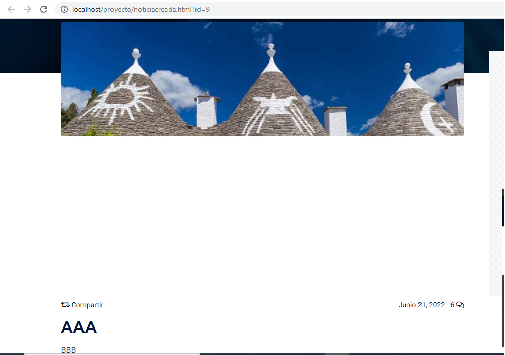

# Portal de Noticias

Hemos escogido esta idea porque es la que mas se adapta a lo que queremos hacer y parece divertida y mas sencilla y productiva que otras.
Se basa en una web con un apartado de Registro, Login,Pagina principal y dos subapartados.
En la pagina principal veremos noticias varias y en los subapartados tendremos uno dedicado al deporte y otro a noticias de la actualidad.
Hemos añadido algunas funciones mas como la creacion de noticias.

## Descripción del proyecto:

La idea es hacer una página de noticias convencional, donde puedas informarte y ver las noticias en sus respectivos apartados. Cada noticia enviará al usuario a una página, y dependiendo que tipo de noticia sea, le enviará a su página principal correspondiente. En cada uno de los apartados, hay links a redes sociales, y en el apartado de noticias, tendrán videos reproducibles y fotos en carrusel con sus respectivos temas. Cada usuario puede comentar su opinión en la caja de comentarios. El index mostrará todas las noticias, y arriba se podrá acceder a los distintos apartados.

## Descripción de las características

Sera un portal de noticias que tendrá seis páginas: index, login, register, deporte, actualidad y conocenos, con registro y envío de usuarios a la base de datos(en FrontEnd). Se podrán ver dos tipos de noticias, actualidad y deportes. Habrá registro, y cajas de comentarios para interactuar y opinar entre noticias. Se utilizara la programación básica `HTML` , `CSS`, `JS`, `PHP` y `bootstrap`. Para la base de datos usaremos `PhpMyAdmin` y `freemysqlhosting` mariadb. También usaremos `GitHub` para control de versiones de nuestro repositorio.

## Creacion de noticias desde la propia pagina

Hemos creado 2 apartados en el footer que te permiten creear una noticia con imagen en una base de datos y luego en el siguiente apartado ver las noticias creadas.

## Distribucion archivos

Utilizaremos de estructura de archivos la siguiente:

- Proyecto (pagina principal todos los archivos .html .js .css .php y este .md).

- Assets (seria lo mismo que libs, donde tendremos nuestras librerias).

- conf (contiene un archivo php que utilicemos para las contraseñas pero ya no lo necesitaremos).

- doc (contiene entrega 1 con sus respectivos archivos y entrega2 y aparte tambien hemos añadido una pequeña descripcion en formato word que hemos utilizado un md).

- src (con la carpeta /images donde habran algunas imagenes utilizadas).

- vendor (Carpeta incluida al proyecto).

- wireframes (Aqui hemos añadido los wireframes del proyecto.)

## Pagina web

- Nuestra pagina web esta ubicada en :
- http://www.loremus.tk (subida desde github, hemos usado un dns hemos utilizado la pagina www.freenom.com para el dominio dns)

## Pagina web DEMO

- La demo esta en :
- https://loremus.herokuapp.com/

## base de datos

- la base de datos funciona perfectamente en /localhost pero no via online porque la base de datos de la pagina freesqlhosting esta dando problemas y algunos fallos, la base de datos es totalmente funcional, los datos se envian bien a la base de datos y tambien los pide bien de vuelta desde localhost.

- He tenido que dejarlo en localhost la opcion de `Crear Noticia` y `Noticias Creadas` por problemas de la pagina `freemysqlhosting`.

- Adjunto unas imagenes de la base de datos y su funcionalidad

- Base de datos despues de añadir noticias atraves del HTML en localhost:
  

- Pagina del apartado de Noticias creadas(1,2,3) en localhost, como se ve la noticia creada:
  
